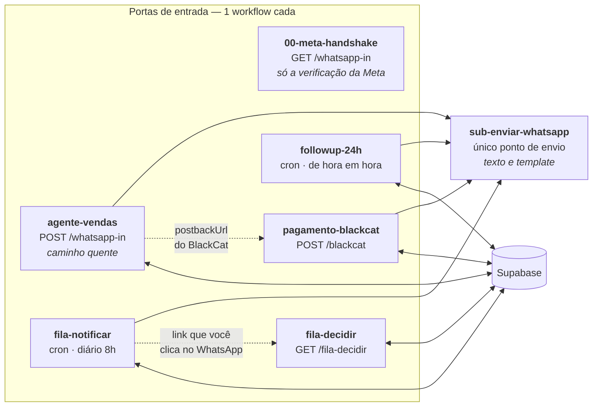

# Arquitetura dos Workflows — Divisão e Conexões

## O princípio: um workflow por gatilho, mais o que é compartilhado

No n8n, **a unidade de ativação, de log e de erro é o workflow**. Isso decide a
divisão: cada porta de entrada vira um workflow próprio, para poder ser
ativada, desativada e depurada sem tocar nas outras. O que é *usado por
várias* delas vira sub-workflow.

Concretamente, o que a divisão compra:

- Desativar o follow-up por uma semana sem parar a venda.
- Ver no histórico de execuções **qual** gatilho falhou, sem filtrar 116 nós.
- Editar o fluxo de venda sem risco de derrubar a inscrição do webhook da Meta.
- Trocar o `phone_number_id` **num lugar**, não em nove.

---

## O desenho

**As setas pontilhadas não são conexões do n8n — e é assim que tem que ser.**
`agente-vendas` alcança `pagamento-blackcat` porque o BlackCat chama o webhook
de volta; `fila-notificar` alcança `fila-decidir` porque você clica num link.
Quem liga um gatilho ao outro é uma chamada HTTP externa. Ligar por aresta
interna seria errado: acopla dois ciclos de vida que são independentes de fato.

---

## Por que cada separação existe

### `00-meta-handshake` fora do `agente-vendas`

A verificação da Meta é um **GET**; as mensagens chegam por **POST**. O n8n
registra webhook por par (path, método), então os dois convivem no mesmo path.

Separar é o que impede um acidente concreto: para editar o fluxo de venda você
desativa o workflow — e se o handshake morasse lá dentro, ele sairia do ar
junto. O handshake é ativado uma vez e nunca mais tocado; a venda muda toda
semana. Ciclos de vida diferentes, workflows diferentes.

### `sub-enviar-whatsapp` como sub-workflow

Antes: **9 cópias** do mesmo `POST /messages`, cada uma com o
`<<WHATSAPP_PHONE_NUMBER_ID>>` embutido.

| Antes | Agora |
|---|---|
| Trocar o `phone_number_id` = acertar 9 nós sem esquecer nenhum | 1 nó |
| Tratar erro de envio = 9 implementações | 1 |
| Detectar janela de 24h fechada | feito uma vez, vale para todos |

O contrato de entrada é um item com `{to, tipo, texto}` ou
`{to, tipo:'template', template_nome, template_params}`, e a saída é sempre
`{ok, id_mensagem, erro}` — **falha de envio não derruba quem chamou**. Um
WhatsApp que não sai não pode abortar a gravação da venda no banco.

> **Não abstraí a escrita em `conversas`**, apesar de estar em 4 lugares: cada
> uma grava campos diferentes, então o sub-workflow precisaria de uma interface
> genérica — que é exatamente o que o nó HTTP já é. Seria indireção sem ganho.
> Sub-workflow se justifica por reuso *real*, não por contagem de ocorrências.

### `carregar_contexto` no banco, em vez de 3 buscas no n8n

O caminho quente fazia 3 GETs em paralelo (histórico, prompt ativo, catálogo) e
precisava de **dois nós `Merge`** só para esperar os três — sem essa barreira o
nó seguinte rodava mais de uma vez e duplicava a chamada à OpenAI e o envio.

Virou uma função no Postgres ([`migracao-robustez.sql`](../supabase/migracao-robustez.sql)):

| | Antes | Agora |
|---|---|---|
| Idas ao banco por mensagem | 3 | **1** |
| Nós no caminho quente | 5 | **1** |
| `mergeByPosition` | 2 | **0** |

O ganho maior não é latência, é ter eliminado o `mergeByPosition`: ele casa
itens por índice e, se um lado vier com contagem diferente do outro, **erra em
silêncio** — cruzando o histórico de um lead com o prompt de outra posição.

---

## Os 8 arquivos

| Arquivo | Papel | Ativar? |
|---|---|---|
| `00-meta-handshake.json` | verificação do webhook da Meta | ✅ sim |
| `agente-vendas.json` | recebe mensagem, vende, gera link | ✅ sim |
| `pagamento-blackcat.json` | pagamento, entrega, recuperação | ✅ sim |
| `followup-24h.json` | template pós-24h | ✅ sim |
| `fila-notificar.json` | digest diário do Hermes | ✅ sim |
| `fila-decidir.json` | aplica sua decisão | ✅ sim |
| `sub-enviar-whatsapp.json` | envio compartilhado | ⚠️ **não** — sub-workflow não se ativa |
| `workflow-completo.json` | os 6 gatilhos num arquivo | ❌ **não ative** — ver abaixo |

### Sobre o `workflow-completo.json`

Serve para **olhar** a operação inteira de uma vez. Não serve para rodar:

1. **Colisão de webhook.** Se ele e os individuais estiverem ativos juntos, dois
   workflows disputam o path `whatsapp-in`.
2. **Perde a ativação independente** — o motivo de toda esta divisão.
3. **Log misturado** — 116 nós de 6 gatilhos no mesmo histórico.

Continua sendo gerado (`gerar-workflow-completo.py`) para não divergir, mas o
que vai para produção são os 7 arquivos individuais.

## Verificação

Além da checagem estrutural (órfãos, colisões, referências, sintaxe), os
workflows são executados de verdade pelo
[`simulador/`](simulador/README.md) — grafo percorrido fora do n8n contra um
Postgres real. São 34 verificações cobrindo o funil completo e o ciclo Hermes.
Foi o simulador que encontrou os ramos invertidos no IF de opt-out e o
`$json.body` quebrado no pagamento; nenhum dos dois aparece em validação
estática.

---

## Relacionado
- [`workflows/README.md`](workflows/README.md) — o que cada nó faz e por quê
- [`../APLICAR-AO-VIVO.md`](../APLICAR-AO-VIVO.md) — o passo a passo de implantação
- [`../VALIDACAO.md`](../VALIDACAO.md) — como confirmar que funcionou
