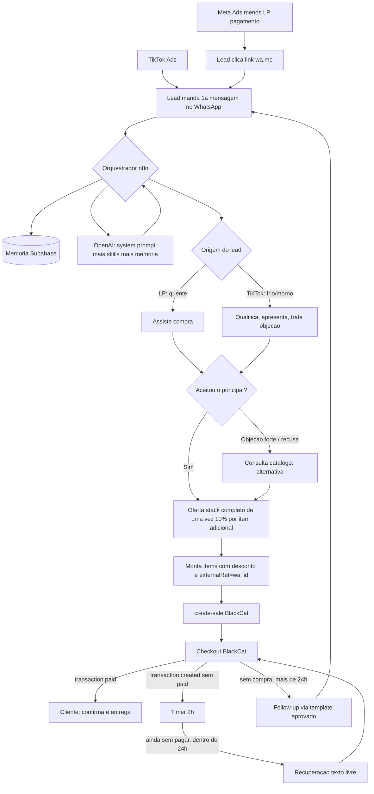

# Workflow — Do Lead ao Cliente

Esqueleto operacional do orquestrador (n8n). Consolida as decisões tomadas
até aqui. Este é o documento vivo do "encanamento"; o *conteúdo* que passa por
ele (o que o agente diz) vem do núcleo (`../00-nucleo/`) e das skills
(`../10-skills/`).

## Decisões que moldam este workflow

| Decisão | Valor |
|---|---|
| WhatsApp | Cloud API oficial (Meta) |
| LLM | OpenAI |
| Orquestrador (tempo real) | n8n — webhooks, timers, cron, envio de mensagens |
| Inteligência (assíncrona) | Hermes Agent — análise periódica, gera sugestões, nunca fala com lead nem edita o núcleo direto (ver `hermes/`) |
| Checkout | BlackCat, com `items[]` cobrindo produto + bumps num link único |
| Memória | Supabase (ver `../20-memoria/`) |
| Caminho A (Meta → LP) | Lead chega **quente**: já quer comprar. Agente assiste a compra e oferta bumps — pula descoberta longa. |
| Caminho B (TikTok → WhatsApp) | Lead chega **frio/morno**: agente qualifica, apresenta, trata objeção. |
| Recuperação de checkout abandonado | 2h após `transaction.created` sem pagamento, **texto livre** (dentro da janela de 24h) |
| Bom dia diário | **Não** faz parte deste agente |
| Follow-up pós-24h | Template aprovado ("limpo") |

## Por que a janela de 24h quase não pesa aqui
Em ambos os caminhos é o **lead quem inicia a conversa no WhatsApp** (clique em
`wa.me` a partir da LP, ou contato direto vindo do TikTok). Isso abre a janela
de 24h e libera texto livre para: a venda assistida, a qualificação, e a
recuperação de 2h. **Só o follow-up além de 24h exige template.**

---

## Diagrama

---

## Node a node

### GATILHO 1 — Mensagem recebida no WhatsApp
1. Webhook do WhatsApp Cloud API recebe a mensagem.
2. Normaliza `wa_id` e identifica a origem (parâmetro do link `wa.me`: `tiktok`
   ou `lp`).
3. Lê a memória no Supabase (`../20-memoria/schema-lead.md`): lead existe?
   Carrega perfil, etapa, histórico.
4. Monta o contexto: system prompt (`../00-nucleo/objetivo.md`
   **+ `../00-nucleo/compliance-e-etica.md`, sempre carregado**) + skills
   relevantes (`../10-skills/`) + memória + mensagem nova.
   O `compliance-e-etica.md` é a fonte única das regras de conduta e **precisa**
   estar em todo contexto — é o que mantém o guardrail ativo em runtime.
5. Chama a OpenAI.
6. Envia a resposta pelo Cloud API.
7. Grava o evento em `../20-memoria/schema-conversa.md`.
8. **Branch por origem:**
   - **LP (quente):** confirma o que já quer comprar → vai direto para o
     bloco de oferta de stack.
   - **TikTok:** qualifica → apresenta → trata objeção (processo completo do
     núcleo) → ao aceitar, vai para o bloco de oferta de stack.

### BLOCO — Oferta de stack (após aceite do principal)
1. Agente apresenta **todos os complementos de uma vez** (não um a um),
   citando o desconto real por item adicionado (10% sobre o total por item,
   ver `../catalogo-produtos.md`).
2. Lead escolhe quais adicionar.
3. Se, em vez de aceitar, o lead **recusa o principal** ou repete objeção
   forte após já ter sido tratada uma vez → orquestrador consulta o
   **catálogo** (seção "pivô") e o agente oferece a alternativa.

### BLOCO — Geração do link (ver `blackcat/criacao-transacao.md`)
1. Orquestrador monta `items[]` a partir do carrinho decidido.
2. Aplica o desconto real no valor total.
3. Inclui `externalRef = wa_id`, `metadata` (arquétipo, etapa) e UTMs de
   origem.
4. Chama `create-sale` do BlackCat, recebe o link, envia ao lead.

### GATILHO 2 — Webhook BlackCat: `transaction.paid`
1. Casa `externalRef` com o lead.
2. Marca `status = cliente`, grava produtos/valor.
3. Envia confirmação + entrega (texto livre).
4. Cancela timer de 2h, se ativo.

### GATILHO 3 — Webhook BlackCat: `transaction.created` (sem pagamento)
1. Casa `externalRef`, marca `status = checkout_abandonado`.
2. Arma timer de 2h.
3. Ao disparar, se ainda sem pagamento e dentro de 24h → recuperação em
   texto livre, endereçando a objeção mais provável daquele carrinho.

### GATILHO 4 — Follow-up pós-24h
1. Cron verifica leads sem compra com última interação > 24h.
2. Dispara template aprovado ("limpo", sem promessa que não possa ser
   cumprida) para reabrir a conversa.
3. Se o lead responde, a janela de 24h reabre → volta ao Gatilho 1.

### GATILHO 5 — Ciclo de aprendizado (Hermes, assíncrono, fora do tempo real)
Não interage com o lead. Roda em paralelo aos Gatilhos 1-4, lendo o que eles
produziram. Ver especificação completa em [`hermes/ciclo-aprendizado.md`](hermes/ciclo-aprendizado.md).

1. Cron **diário** dispara o Hermes; ele só analisa se houver **≥ 25 conversas
   novas** desde o último ciclo (senão pula o dia). Ver `hermes/configuracao.md`.
2. Hermes gera hipóteses `[SUGESTÃO N]`.
3. Classificador de conformidade rotula o risco de cada sugestão
   (`alto`/`medio`/`baixo`) sem descartar nenhuma.
4. **Todas** as sugestões entram na fila de aprovação
   (`hermes/fila-aprovacao.md`), com as de risco alto no topo.
5. Você aprova ou rejeita no n8n. Ao aprovar, **o n8n aplica a mudança
   automaticamente** na versão ativa do prompt/skill (sem edição manual;
   versão anterior guardada para reverter).
6. Mudança aplicada volta a gerar dados nos Gatilhos 1-4 → fecha o ciclo.

---

## Pendências (bloqueiam a implementação, não o desenho)
- [ ] Preços e produtos reais do catálogo (`../catalogo-produtos.md`) —
      definição com os sócios.
- [ ] Texto do template de follow-up pós-24h, para submissão à aprovação da
      Meta.
- [x] Cadência e volume mínimo do Hermes: **diário, ≥ 25 conversas novas**
      (ver `hermes/configuracao.md`).
